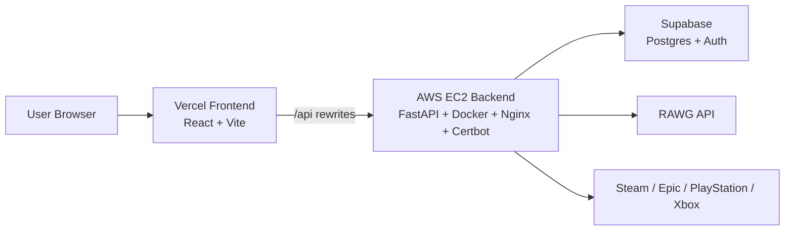

# GameOn

GameOn is a full-stack game discovery, review, and price-comparison platform built with a FastAPI backend, Supabase, RAWG, and a modern React/Vite frontend.


## Overview

GameOn lets players discover games, compare live storefront prices, write reviews, track what they want to play, and follow friends. The backend is containerized and self-hosted on AWS EC2 behind Nginx with Certbot-managed HTTPS, while the frontend is deployed on Vercel.

## Why This Project Stands Out

- Self-hosted the containerized FastAPI backend on AWS EC2 instead of managed platforms using Docker, Nginx, automatic restarts, and Certbot for zero-downtime, auto-renewing SSL.
- Built a feature-rich game community product with discovery, reviews, reactions, social graphs, lists, profile management, and live price aggregation.
- Added layered caching, rate limiting, auth hardening, and image proxying to keep the app fast and safe under load.
- Shipped a polished PWA-capable frontend with React, Vite, React Router, React Query, Supabase JS, and Tailwind CSS.

## Tech Stack

| Layer | Stack |
|---|---|
| Frontend | React 19, Vite, React Router v7, React Query, Tailwind CSS, Supabase JS, Axios, Lucide React, Vite PWA |
| Backend | FastAPI, Uvicorn, Pydantic, httpx, python-jose |
| Data | Supabase Postgres, Supabase Auth |
| External APIs | RAWG Video Games API, Steam, Epic Games, PlayStation Store, Xbox Store |
| Infrastructure | Docker, AWS EC2, Nginx, Certbot, Vercel |

## Core Features

### Game Discovery

- Search games with per-IP rate limiting.
- Browse featured and popular game feeds from RAWG.
- Open detailed game pages with screenshots and a RAWG image proxy.
- Fetch multiple games in batches for richer UI rendering.

### Price Aggregation

- Pull live prices from Steam, Epic Games, PlayStation Store, and Xbox Store.
- Parse RAWG store links and use title-matching heuristics to find the right store page.
- Cache price results to reduce repeated scraping and API calls.

### Reviews and Reactions

- Create, edit, and delete reviews with 1-10 ratings and long-form text.
- Enrich review feeds with like/dislike counts, score, and the current user’s reaction.
- Show popular and recent review feeds with in-memory caching.
- Surface review-like notifications for signed-in users.

### Social Features

- View public profiles and edit your own profile.
- Track game status with want-to-play, playing, and played lists.
- Send, accept, and remove friend requests.
- Browse a friends-only review feed and a social summary of requests and friendships.

### Platform Hardening

- JWT auth using Supabase JWKS with cached key rotation.
- Security headers, CORS allow-listing, and gzip compression.
- Feed, search, screenshot, price, and JWKS caches to reduce latency.
- Rate limits for search, review writes, and friend requests.
- PWA support in the frontend build.

## Architecture



The frontend is deployed on Vercel. The backend runs on AWS EC2 in Docker behind Nginx, with Certbot providing auto-renewing TLS. The Docker Compose files in this repository are for local development and testing only, not production deployment.

## Local Development

### Backend

```bash
cd backend
pip install -r requirements.txt
uvicorn app:app --reload
```

### Frontend

```bash
cd frontend/GameOnFrontend
npm install
npm run dev
```

### Full Local Stack

```bash
docker compose up
```

## Environment Variables

Backend:

- `SUPABASE_URL`
- `SUPABASE_ANON_KEY`
- `SUPABASE_SERVICE_ROLE_KEY`
- `RAWG_API_KEY`
- `FRONTEND_URL` or `FRONTEND_URLS`
- `PORT`
- `UVICORN_WORKERS`

Frontend:

- `VITE_API_URL`
- `VITE_SUPABASE_URL`
- `VITE_SUPABASE_ANON_KEY`

## Project Structure

```text
GameOn/
├── backend/
│   ├── app.py
│   ├── db.py
│   ├── dockerfile
│   ├── middleware/
│   │   └── auth.py
│   ├── routers/
│   │   ├── games.py
│   │   ├── lists.py
│   │   ├── reviews.py
│   │   ├── socials.py
│   │   └── users.py
│   └── services/
│       ├── rawg.py
│       └── store_prices.py
├── frontend/
│   └── GameOnFrontend/
│       ├── src/
│       ├── vite.config.js
│       ├── nginx.conf
│       └── Dockerfile
├── docker-compose.prod.yml
└── readme.MD
```

## API Surface

### Games

- `GET /games/search`
- `GET /games/featured`
- `GET /games/popular`
- `GET /games/image-proxy`
- `POST /games/batch`
- `GET /games/{game_id}`
- `GET /games/{game_id}/prices`
- `GET /games/{game_id}/screenshots`

### Reviews

- `GET /reviews/game/{game_id}`
- `GET /reviews/game/{game_id}/mine`
- `GET /reviews/me`
- `GET /reviews/me/count`
- `GET /reviews/me/like-notifications`
- `GET /reviews/popular`
- `GET /reviews/`
- `POST /reviews/`
- `PUT /reviews/{review_id}`
- `DELETE /reviews/{review_id}`
- `POST /reviews/{review_id}/reaction`
- `DELETE /reviews/{review_id}/reaction`

### Users

- `GET /users/me`
- `PUT /users/me`
- `DELETE /users/me`
- `GET /users/{user_id}`
- `PUT /users/{user_id}`
- `GET /users/{user_id}/reviews`

### Lists

- `GET /lists/me`
- `GET /lists/me/{rawg_game_id}`
- `POST /lists/`
- `PUT /lists/{rawg_game_id}`
- `DELETE /lists/{rawg_game_id}`

### Socials

- `GET /socials/summary`
- `GET /socials/search`
- `POST /socials/requests`
- `POST /socials/requests/{request_id}/accept`
- `DELETE /socials/requests/{request_id}`
- `DELETE /socials/friends/{friend_id}`
- `GET /socials/friend-reviews`

## Deployment Notes

- Frontend: Vercel
- Backend: AWS EC2
- Reverse proxy: Nginx
- TLS: Certbot with auto-renewal
- Production container orchestration: Docker on EC2
- Local testing only: `docker-compose.yml` and `docker-compose.prod.yml`
