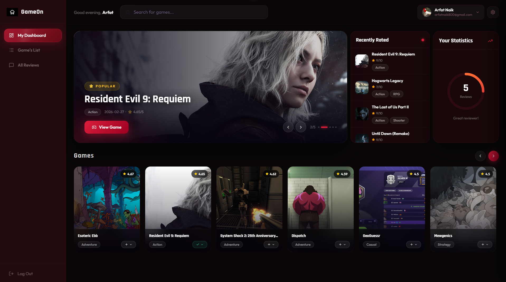
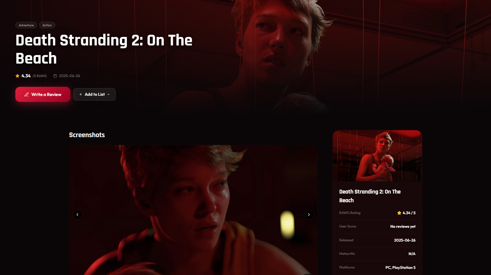

# GameOn 🎮

Full-stack game discovery + review platform powered by RAWG API, Supabase, and FastAPI.

---

## 🚀 Live Demo

- 🔗 Live App: https://gameon.up.railway.app/

- 🎥 Demo / Preview:  






---

## 📦 Project Structure
```
backend/
├── app.py
├── db.py
├── requirements.txt
├── dockerfile
├── .env.example
│
├── routers/
│ ├── games.py
│ ├── users.py
│ ├── reviews.py
│ └── lists.py
│
├── middleware/
│ └── auth.py
│
└── services/
└── rawg.py
```

## Features

## ✅ Features Completed

- Game browsing (search, featured, popular)
- Full game details + screenshots (RAWG API proxy)
- Google OAuth authentication (Supabase)
- Secure JWT auth (ES256 + JWKS caching)
- User profiles (view, edit, delete account)
- Review system (CRUD, 1–10 rating, per-game + global feed)
- Game list tracking (want to play / playing / played)
- Per-IP rate limiting on search
- RAWG API cache layer (7-day TTL, DB-backed)
- Optimized DB queries (no N+1 issues)
- Global Supabase clients (no redundant connections)
- GZip compression + frontend caching (React Query)
- Fully Dockerized + deployed (Railway)

---

## ⏳ Next Features

- Social system (follow users, activity feed)
- Review likes / engagement signals
- Game recommendations (similar games / personalized)
- Advanced search filters (genre, platform, release year)
- Screenshots caching (same pattern as game cache)
- DB indexing for heavy queries (reviews, lists)
- Better frontend caching (`staleTime` tuning)
- Notifications (email or in-app)

---

## API Overview

### Games
- `GET /games/search`
- `GET /games/featured`
- `GET /games/popular`
- `GET /games/{id}`
- `GET /games/{id}/screenshots`

### Reviews
- `GET /reviews/game/{id}`
- `GET /reviews/`
- `POST /reviews`
- `PUT /reviews/{id}`
- `DELETE /reviews/{id}`

### Users
- `GET /users/me`
- `PUT /users/me`
- `DELETE /users/me`
- `GET /users/{id}`

### Lists
- `GET /lists/me`
- `POST /lists`
- `PUT /lists/{game_id}`
- `DELETE /lists/{game_id}`

---

## Tech Stack

- **Backend:** FastAPI  
- **Database/Auth:** Supabase  
- **External API:** RAWG  
- **HTTP Client:** httpx  
- **Auth:** JWT (ES256)  
- **Deployment:** Docker + Railway  

---

## Setup

```bash
git clone <repo>
cd backend
pip install -r requirements.txt
create .env:
 SUPABASE_URL=
 SUPABASE_ANON_KEY=
 SUPABASE_SERVICE_ROLE_KEY=
 RAWG_API_KEY=
 FRONTEND_URLS=http://localhost:5173
run:
 uvicorn app:app --reload

---